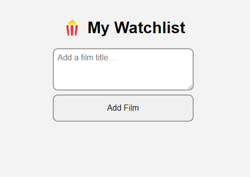
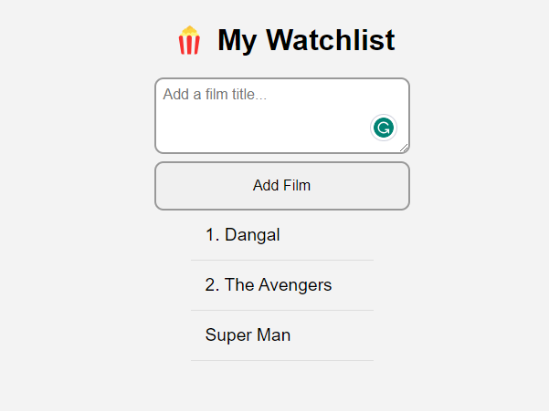

# Film Watchlist
A very simple watchlist which you can add your movies and other things on it.

https://my-watchlist-film.netlify.app/






## Languages and Tools are used

1. **Languages**

    + [HTML](https://github.com/topics/html)
    + [HTML5](https://github.com/topics/html5)
    + [CSS](https://github.com/topics/css)
    + [CSS3](https://github.com/topics/css3)
    + [JavaScript](https://github.com/topics/javascript)

2. **Tools** 

    + [Chrome](https://github.com/topics/chrome)
    + [VSCode](https://github.com/topics/vscode)
    + [Figma](https://github.com/topics/figma)
    + [Netlify](https://github.com/topics/netlify)

-----


## For cloning the project 🪛

```
# Clone this repository
$ gh repo clone MastooraTurkmen/My-Watchlist

# Go inside the repository
$ cd my-watchlist

```


## Deployment📥
1. How to deploy our project to netlify site?
2. I use [Netlify App](https://app.netlify.com/) for deploying my projects.
3. Go to Netlify site and select Add a new site.
4. From there select **_Deploy with Github_**.
5. Then write your project name and select it.
6. After selecting here you can see that the project **_Review configuration for My-Watchlist_** and then select the **_Deploy My-Watchlist_** Button.
